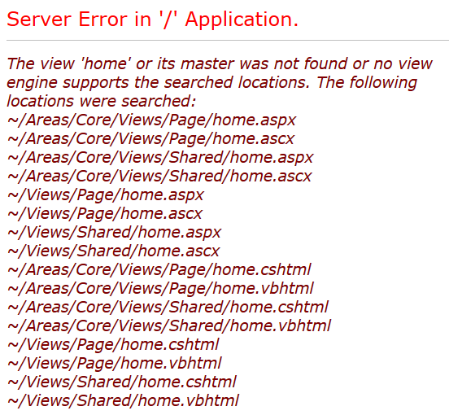
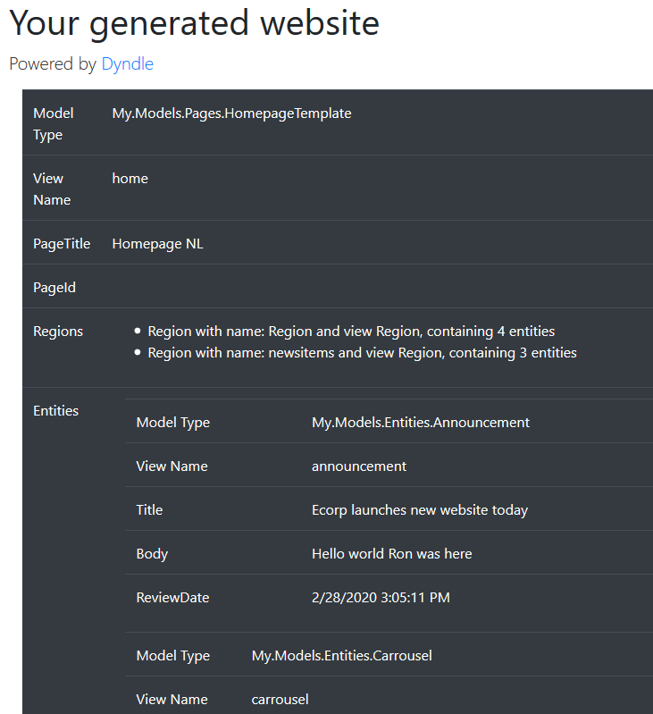

There are two ways to set up a web application with Dyndle:


In this manual we will be using the Quickstart. If you want to use Dyndle without the Quickstart, see [Manual Installation](manual-installation.html). Note that in both cases you will need to [install the Content Management components](installation-cm.html) first.

> ### What does the Quickstart do?
>
> The Dyndle Quickstart makes it easy for you to create a new web application. It does so with as little interference with your own project as possible.
>
> The quickstart is mainly responsible for the instantiation of Dyndle and DD4T classes through dependency injection, the registration of controllers, loading ViewModels and setting up routing.
>
> One thing which is important to know: when you add a reference to the DD4T.Quickstart.Web project to your web application, a class called StartDyndle is created in the App_Start folder. This is the starting point for Dyndle. You can choose to modify this class, but you don't have to.
>
> The quickstart uses Autofac as its dependency injection framework. DD4T and Dyndle support many other DI-frameworks too (like Ninject and SimpleInjector) but by using the Quickstart, you are picking Autofac for this job.

### Setting up a web application with Dyndle Quickstart

1. In Visual Studio, select 'Create a new project'
2. Create a new ASP.NET Web project (use C#)
3. On the next screen (Configure your new project), enter a project name and select the desired .NET Framework version (should be at least 4.6.2)
4. On the next screen (Create a new ASP.NET Web Application), choose **Empty** version and add references to MVC with the checkbox on the right
5. Install the Dyndle.Core NuGet package
6. Install one of the Dyndle.Providers packages (SDLWeb81, SDLWeb85 or Tridion9 - which also supports Tridion 9.1!)
7. Install Dyndle.Quickstart.Web
8. Open the Web.config in the root of your site and change the following:
   - Find _discovery-service-uri_ and enter the URL of the Tridion discovery service in your environment.
   - If your discovery service is protected with oauth, also enter the appropriate values for _oauth-enabled_, _oauth-client-id_ and _oauth-client-secret_. See https://docs.sdl.com/LiveContent/content/en-US/SDL%20Tridion%20Sites-v2/GUID-2B16D132-8587-4FD7-8426-1A50FE25472F for the official SDL product documentation.
   - Remove the appSettings with key name starting with "JMS". You can add it back later, see [Enabling caching with Dyndle](https://)
   - The 'WelcomeFile' indicates the filename + extension to be added after the URL of a structure group (a 'directory' in Tridion). If you want to use something other than _index.html_, you can change the value.

You don't need to change the other Dyndle and DD4T settings unless you want to. The settings are explained in detail in [How to configure Dyndle](configuration.html).

### Publication resolving

In order to run your application, you need to configure the publication from which you want to serve the pages. This can be done in two ways:

1. By adding the URL of your site to Tridion's Topology Manager. Dyndle will use this information to automatically show the pages from the correct publication.
2. By adding a **DD4T.PublicationId** key to the appSettings of your Web.config, containing the ID of the publication you want to serve pages from.

We normally recommend to go with option 1, but if you plan to run your web application from within Visual Studio, using IIS Express, this means you have to configure a BaseUrl like 'http://localhost:45728' - or whichever port IIS Express has picked. Also, you need to have access to a Tridion CM server and permission to run SDL's PowerShell commands. If you don't want to bother with any of that, just go for option 2.
You can always come back on your decision: as soon as you remove the DD4T.PublicationId key, Dyndle will resolve the publication once again based on the information in Topology Manager.

### Run your application

You are now ready to run the application. Press the Run button in Visual Studio and request a page which you have published in step 1. You will see something like this:


This is nothing to worry about. It is actually good news: it means you are ready for the next step - adding models and views to your application.

## 4. Adding models and views

Of course you can create your models and views yourself. But you can also let Dyndle generate them for you.

Model generation is a very useful feature of Dyndle. Dyndle will create a model class for each schema in Tridion. This will save you a lot of time and is less error-prone than creating them manually. And even though the models are generated, you can still extend and tailor them, as is described in [Customizing generated models](customizing-models.html). But of course, you can still create all models manually if you want.

View generation is a different matter. For almost all implementations, you will be creating views manually, because the views are where you generate the look and feel that you (or your customer) wants to see. However, Dyndle allows you to generate views from the content manager. The generated views provide a good example and serve as a starting point.

To get you started as quickly as possible, we will show you how to generate both the models and the views.

First, you need to decide which namespace you want to use for your models. For example: _MyCompany.Web.Models_. Dyndle will automatically create a sub-namespace for entities (aka component presentations) and one for pages. In this example, the namespaces will be: - MyCompany.Web.Models.Entities - MyCompany.Web.Models.Pages

When you generate models or views, Dyndle will create Nuget packages which you can import into your application. If you have a private Nuget repository already, you can upload these packages there. If not, you can simply set up a folder on your local drive and set it up as a local package source in Visual Studio. In this document we will assume you are using a local folder called D:\NuGet as your local package source.

Next, go to the folder where you have stored the Dyndle tools (see step 1) and start a command prompt there.

Generate a Nuget package for your models like this (replace tcm:0-X-1 with the URI of the publication where you keep your schemas, and make sure the namespace is correct):

```shell=
dyndle models -p tcm:0-X-1 --namespace MyCompany.Web.Models --output-folder D:\NuGet
```

Generate a Nuget package for your views like this:

```shell=
dyndle views -p tcm:0-X-1 --namespace MyCompany.Web.Models --output-folder D:\NuGet
```

- Note: there are many options available to finetune the model and view generation. Check out the documentation or type 'dyndle help models' / 'dyndle help views'

If all went well, you now have a working site which looks like this:



Try any URL in your site to see a description of the pages and the content they contain.

### Next steps

Of course, this is not the web site you want. It is now up to you to make the site your own. You need to change all the views, you can enhance the models, add your own controllers, etc. Check out the rest of the documentation.
