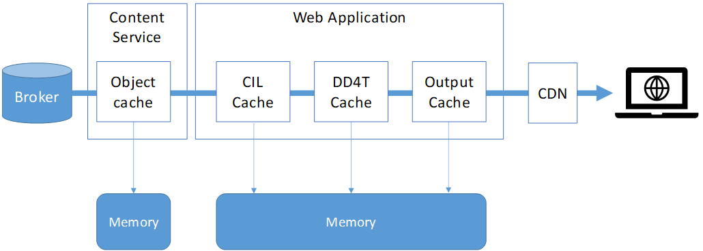

## Overview

When a visitor comes to your Dyndle (or DD4T, or DXA)-empowered web site, data flows from the broker database to the browser, through a number of stations:

- Broker database
- Content service
- Content interaction library
- The DD4T factories
- Razor views
- And perhaps a CDN

This diagram makes it clear:




We recommend to disable the CIL caching in your web application, and enable the DD4T object caching and optionally Dyndle's output caching feature instead. The reason is that the CIL cache is time-based. Items stay in the cache until they expire. The DD4T cache and the Dyndle output cache, on the other hand, can be configured to remove items from cache as soon as they are published or unpublished by Tridion. This allows you to cache them for much longer (even indefinitely, if you want), thereby improving the performance of your site.

The other cache shown in the diagram (the object cache in the content service) can be safely turned on, because this cache is also invalidated automatically. In fact, we strongly recommend to enable this cache (it's done in the cd_storage_conf.xml, check SDL's documentation).

Whether or not you want to use a CDN is up to you. Just know that the invalidation of items cached by the CDN is a very different issue, and requires separate custom coding (for example a custom deployer extension).


## DD4T object caching
DD4T caches every object it retrieves from the broker database (through the content service). It caches them in memory. The time to live (TTL) of each type of item can be configured, by adding a key to the appSettings section of the Web.config, named 'DD4T.CacheSettings.XXX'. The TTL is configured in seconds.

The following configuration means that pages are cached for 5 minutes:

```xml
<add key="DD4T.CacheSettings.Page" value="300" />
```

This table shows the different item types you can configure the TTL for, along with recommended values and - very important - whether or not this item type is decached (invalidated) automatically when the item is (un)published.


| Config key               | Used for   | Recommended value | Decached automatically |
| :------------------------------ | :----------------| :----------------------------- | :------------- |
| DD4T.CacheSettings.Page | Pages  | 3600 or more| Yes |
| DD4T.CacheSettings.Page404 | Pages which don't exist in Tridion  | 30 - 60| No |
| DD4T.CacheSettings.ComponentPresentation | Component presentations   | 3600 or more | Yes |
| DD4T.CacheSettings.Binary | Metadata of published binaries  | 30 - 300 | No |
| DD4T.CacheSettings.Link | Resolved component links, including misses  | 3600 or more | Yes |
| DD4T.CacheSettings.Model | Models that are created from the pages and component presentations  | 3600 or more | Yes |
| DD4T.CacheSettings.Configuration | Site configuration | 30 - 300 | No |
| DD4T.CacheSettings.ContentQuery | The results of content queries  | 300 | No |
| DD4T.CacheSettings.Output | The HTML generated by the page views. Only used if the DD4TOutputCacheProvider is configured | 3600 or more | Yes |


## Output caching

Dyndle comes with a DD4TOutputCacheProvider. This is a custom version of Microsoft's out of the box OutputCacheProvider, which can be configured to respond to incoming cache invalidation messages, and can therefore decache stale items automatically (as soon as they are (un)published).

To use the output cache provider, you need to make the following changes to your web application:

Add the following snippet to the `system.web` element in your Web.config:

```xml
 <caching>
      <outputCache defaultProvider="dd4t">
        <providers>
          <add name="dd4t" type="Dyndle.Modules.Core.Cache.DD4TOutputCacheProvider" />
        </providers>
      </outputCache>
      <outputCacheSettings>
        <outputCacheProfiles>
          <add name="Default" duration="3600" />
        </outputCacheProfiles>
      </outputCacheSettings>
    </caching>
```

Add the following appSetting:

```xml
<add key="DD4T.CacheSettings.Output" value="3600" />
```

Note that the *duration* attribute in the outputCacheProfile and the *value* of the appSetting must have the same value. 

## Cache invalidation 

DD4T can be configured to automatically decache items when they are republished or unpublished. This is described [here](https://github.com/dd4t/DD4T.Caching.ApacheMQ).

If you are using SDL Web 8.1 or lower, you need to do one more thing in order for cache invalidation to work. You must add the following to the appSettings section of your Web.config:

```xml
  <add key="DD4T.UDPEnabled" value="false" />
```

Explanation: DD4T consumes messages that are produced by the Tridion deployer. With the introduction of SDL Web 8.5, the format of these messages has changed. This has to do with the so-called 'Unified Delivery Platform' - the revised delivery / deployer architecture created by SDL. A UDP deployer can deliver content coming from SDL Tridion Sites as well as SDL Tridion Docs. As a result, the messages sent to invalidate items has an extra string attached to it to identify the 'namespace' - "1:" for Sites and "2:" for Docs.

With the UDPEnabled key, you let DD4T know which version of the messages it can expect.


## Cache browser

If you add a NuGet reference to Dyndle.Modules.Management, a cache browser is automatically added to your application. Just start the site and browse to /admin/cache. You will be able to view all the items in the cache, search for items, remove items or clear the entire cache.

If you have put the @Html.ShowDebugInfo() in your layout view (as described in the documentation of the [Management module](management.html)), you will see a button top right that opens the cache browser in a separate tab.

## Preview-aware cache agent

If you plan to use [Experience Manager](xpm.html) in combination with Dyndle, it is good to know that Dyndle has a PreviewAwareCacheAgent, which is automatically loaded for staging environments, to replace DD4T's DefaultCacheAgent. The PreviewAwareCacheAgent detects when you are executing a session preview in Experience Manager, and automatically disables caching for pages and component presentations if you are. 

To enable this cache agent, all you need to do is add this appSetting to the Web.config:

```xml
<add key="Dyndle.StagingSite" value="true" />
```


